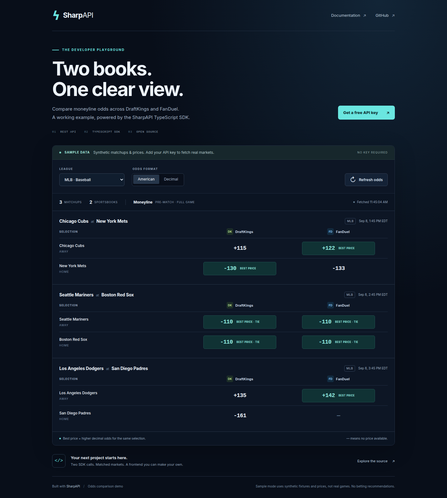

# SharpAPI Odds Comparison

Compare DraftKings and FanDuel pre-match moneylines in a small browser app built with the SharpAPI JavaScript SDK. Highlight the better available price for the same outcome, switch leagues and odds formats, and see when each quote was refreshed.



## Run without an API key

Install [Node.js 22 or newer](https://nodejs.org/) and Git, then run:

```bash
git clone https://github.com/Sharp-API/SharpAPI-TS.git
cd SharpAPI-TS
npm ci
npm run demo:sample
```

Open **http://127.0.0.1:3000**. You should see three illustrative MLB matchups, DraftKings and FanDuel columns, best-price labels, a tied price, and one unavailable quote. Try another league or switch from American to decimal odds.

**Sample mode is synthetic.** The matchups, relative start times, and prices are illustrative; they do not represent a real schedule or sportsbook feed. This mode makes no API requests. The screenshot uses sample mode.

## Use your free API key

[Create a free SharpAPI account](https://sharpapi.io/pricing) and copy your API key from the dashboard. Stop the sample server with Ctrl+C, then set the key in your terminal:

**macOS / Linux (Bash)** — the prompt keeps the key out of shell history:

```bash
read -rsp 'SharpAPI key: ' SHARPAPI_API_KEY; echo
export SHARPAPI_API_KEY
npm run demo
```

**Windows PowerShell:**

```powershell
$credential = Get-Credential -UserName 'SharpAPI' -Message 'Paste your API key in the password field'
$env:SHARPAPI_API_KEY = $credential.GetNetworkCredential().Password
npm run demo
```

`npm run demo` builds and uses the SDK in this checkout, so this example does not depend on unpublished changes being available on npm. The server reads `SHARPAPI_API_KEY` from its environment; it does not automatically load `.env` files. See [.env.example](.env.example) for the variable names. Never commit an API key.

Reopen **http://127.0.0.1:3000**. The mode label changes to API data. MLB is the default; select NFL, NBA, or NHL as appropriate for the season. An empty result is normal when no eligible upcoming markets are available. API failures remain visible and never switch the app to sample data.

## What the example does

- Uses `api.odds.get()` once per book with `league`, `market: 'moneyline'`, `live: false`, and `limit: 200`.
- Consumes the API's snake_case response fields. Joins by canonical `event_uuid` and `selection_type`; book-native IDs and team names are not cross-book identifiers.
- Shows mapped, open, upcoming full-game two-way moneylines only. Unmapped events, started events, suspended markets, period markets, and three-way moneylines are excluded.
- Uses the newest duplicate quote per book. Higher decimal odds mean a better price for that outcome; both books receive a tie label when equal. A single available quote is not labeled best.
- Fetches at most the first 200 rows per book. A coverage notice appears if more rows may exist. A missing quote means it was absent from this snapshot, not necessarily unavailable at the sportsbook.
- Caches results and failures for 30 seconds per league and coalesces simultaneous refreshes. There is no automatic polling. Each uncached load uses two SDK calls; SDK retries may cause additional HTTP requests.

Free-tier data is delayed by 60 seconds. Fetch time tells you when the demo retrieved its snapshot; each quote's timestamp indicates pipeline freshness, not when its price last changed. Changing leagues or repeatedly restarting the server can consume more of your request allowance.

The best displayed price is a comparison within the fetched snapshot. It is not an expected-value calculation, an arbitrage signal, or a guarantee that a wager can be placed at that price.

## How it works

```text
Browser → local Node server → SharpAPI SDK → SharpAPI API
         ← comparison JSON ← odds snapshots
```

The API key stays in the Node process. The browser receives comparison data only. Static files use no external scripts, fonts, or runtime dependencies. The server binds to `127.0.0.1`, checks Host/Origin headers, and serves an explicit file allowlist.

This is a local development example. Before hosting it, add your own user authentication, quota controls, deployment secret management, and caching policy. Do not expose this local server through a public tunnel.

Files:

| File | Purpose |
| --- | --- |
| `server.mjs` | Local HTTP server, SDK calls, cache, safe error messages |
| `comparison.mjs` | Quote validation, event matching, price comparison |
| `sample.mjs` | Synthetic fixtures |
| `public/` | Responsive HTML, CSS, and browser JavaScript |
| `demo-check.mjs` | Matching, caching, security boundary, and failure tests |

## Troubleshooting

| Symptom | What to do |
| --- | --- |
| API key rejected | Check the key in your terminal environment and restart. |
| Rate limit reached | Wait, check dashboard usage, and avoid repeated league changes. Failures are cached for 30 seconds. |
| One sportsbook request fails | The whole refresh shows an error, so an incomplete upstream response is not presented as a successful comparison. |
| No games | Choose another league or return when upcoming markets are available. Try sample mode to explore the UI. |
| Port already in use | Set `PORT=3100` in Bash or `$env:PORT='3100'` in PowerShell before starting. |

Run `npm run test:demo` from the repository root to check the demo. These tests use local fixtures and stubbed SDK calls; they do not need credentials or consume API quota.

[API reference](https://docs.sharpapi.io/en/api-reference/odds/) · [Status](https://status.sharpapi.io) · [Report an issue](https://github.com/Sharp-API/SharpAPI-TS/issues)
